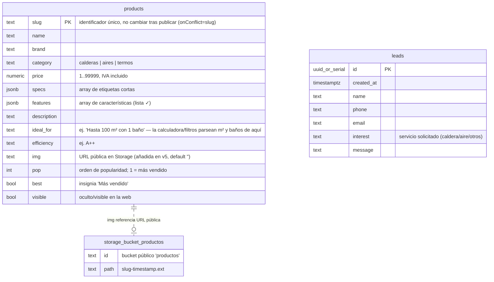

# Arquitectura — Web comercial de Decogas

> Documento de arquitectura del sitio comercial de Decogas (calderas, aires
> acondicionados y termos, con instalación). Documenta la arquitectura **actual
> tal como está** y propone una **evolución razonable** sin sobre‑ingeniería:
> es la web de una empresa pequeña, no un producto SaaS.
>
> **Actualización 19/07/2026:** la migración a Astro descrita en
> `MIGRATION-ASTRO.md` está **completada**. El sitio ahora se construye con Astro
> desde `web/` (el CI publica `web/dist`), aunque toda la lógica de cliente sigue
> siendo el JS vanilla descrito aquí (ahora en `web/public/`). Las menciones a la
> carpeta antigua `"decogas-web (2)"` en los planes de este documento son
> históricas: esa carpeta, `netlify.toml`, `_headers` e `import-antigua/` ya no
> están en el repo (viven en la historia de git). La estructura del §3 está
> actualizada a la real.

---

## 1. Resumen

Decogas es un **sitio web estático** (HTML + CSS + JavaScript vanilla, sin build
ni framework) que usa **Supabase como único backend** (base de datos Postgres +
Auth + Storage), consumido directamente desde el navegador. No hay servidor
propio ni API intermedia: cada página carga sus scripts, y los que necesitan
datos hablan con la REST de Supabase (catálogo público) o con el SDK
`supabase-js` (paneles con login).

La decisión arquitectónica central es el **patrón "static + BaaS con degradación
en cascada"**: la fuente de verdad del catálogo es Supabase, pero si el backend
no responde (o no está configurado) el sitio cae a `localStorage` (modo demo) y,
en última instancia, a datos incrustados en el código (`data-*.js`). Así la web
comercial **nunca se ve vacía** aunque falle la base de datos. Es la arquitectura
más simple que cumple los requisitos: cero coste de servidor, despliegue continuo
a **GitHub Pages** (push a `main` → GitHub Actions), y un panel de administración
que el dueño usa sin tocar código.

**Supuestos** (no había datos explícitos, se toman los más razonables):
- Tráfico bajo: unidades–centenas de visitas/día, un único administrador.
- Catálogo: **290 productos** en Supabase tras importar el catálogo antiguo de
  WordPress (124 calderas, 128 aires, 38 termos; 281 con foto), decenas de leads al mes.
- Prioridad: que la web cargue rápido y no falle nunca de cara al cliente;
  el panel interno puede ser más lento.

---

## 2. Stack

| Capa | Tecnología | Por qué | Alternativa descartada |
|------|-----------|---------|------------------------|
| **Frontend** | HTML5 + CSS3 + **JS vanilla** (ES5-ish, IIFE, `"use strict"`) | Cero build, cero dependencias, cualquiera lo edita. Para una web de catálogo con formularios no hace falta más. | **React/Vite**: añade build, `node_modules` y complejidad de despliegue que este proyecto no necesita ni amortiza. |
| **Backend** | **Supabase** (Postgres + PostgREST + Auth + Storage) | BaaS gestionado, plan gratuito suficiente, RLS da seguridad real con la clave pública en el cliente. Sustituye a montar servidor + BD + auth. | **Servidor Node propio**: implicaría hosting, mantenimiento y despliegues; sobra para este tamaño. |
| **Persistencia catálogo** | Tabla `products` en Postgres, con **fallback** a `localStorage` y a `data-*.js` | El admin edita en vivo y lo ven todos; el fallback garantiza que la web nunca aparezca vacía. | BD como única fuente sin fallback: un fallo de red dejaría el catálogo en blanco de cara al cliente. |
| **Leads (formulario)** | Tabla `leads` (insert anónimo) + **FormSubmit** para el aviso por email | El lead queda guardado y además llega un correo al instante sin montar servicio de email propio. | SMTP/función serverless propia: innecesario habiendo FormSubmit. |
| **Imágenes de producto** | Supabase **Storage** (bucket público `productos`) | Lectura pública para la web, escritura solo autenticada; integrado con el mismo backend. | CDN externo / subir por FTP: más piezas que mantener. |
| **Hosting** | **GitHub Pages** (despliegue continuo vía GitHub Actions, `.github/workflows/pages.yml`) | Estático, HTTPS y CI/CD gratis desde el repo `queren05/decogas`; push a `main` publica solo. | Netlify (drop de carpeta): fue el hosting anterior (su `netlify.toml` y `_headers` ya se eliminaron del repo). **Coste:** Pages **no soporta cabeceras personalizadas**, así que las cabeceras de seguridad (CSP, etc.) están perdidas — ver §7 y `DEPLOY.md`. |
| **Librerías cliente** | `@supabase/supabase-js@2` por CDN (jsDelivr), **solo** en `admin.html` y `clientes.html` | El SDK solo hace falta para Auth y Storage. El catálogo público usa `fetch` a la REST y evita cargar el SDK. | Cargar el SDK en todas las páginas: peso innecesario en las páginas públicas. |
| **Notificaciones email** | FormSubmit (`formsubmit.co/ajax`) | Envío de email sin backend, gratis. | — |

**Sin build, sin bundler, sin gestor de paquetes.** El versionado de assets se
hace a mano con query string (`?v=18`) para forzar refresco de caché.

---

## 3. Estructura del proyecto

Estado **actual** (tras la migración a Astro y la limpieza del 19/07/2026):

```
"C:\Users\dr438\decogas"                 · raíz del repo git (github.com/queren05/decogas, con CI/CD)
├── .github/workflows/pages.yml          · CI: construye web/ con Astro y publica web/dist en Pages
├── README.md                            · documentación principal
├── docs/                                · ARCHITECTURE.md · DEPLOY.md · MIGRATION-ASTRO.md
├── supabase/
│   ├── setup-supabase-v5.sql            · migración: columna img + bucket Storage
│   ├── setup-supabase-v6-seguridad.sql  · endurecimiento de políticas RLS/Storage
│   └── arreglo-storage-admin.sql        · escritura del bucket restringida al email del admin
├── package.json · tests/                · suite de tests (node --test, sin dependencias)
└── web/                                 · === PROYECTO ASTRO (lo que se construye y publica) ===
    ├── astro.config.mjs                 · base /decogas/, integración sitemap
    ├── package.json                     · astro + @astrojs/sitemap
    ├── src/
    │   ├── layouts/                     · Base.astro (páginas) y Articulo.astro (blog)
    │   ├── pages/                       · index, calderas, aires, termos, calcula, guias,
    │   │                                  admin, clientes, legal, 404, blog/[...slug]
    │   └── content/blog/                · 187 artículos en Markdown (colección `blog`)
    └── public/                          · estáticos servidos tal cual (raíz del sitio):
        ├── config.js                    · credenciales Supabase (url + anon key) + email de aviso
        ├── utils.js                     · DecogasUtil: esc/norm/isValidPrice compartidos
        ├── prices.js                    · DecogasStore/DecogasPrices: carga catálogo (REST) con fallback
        ├── catalog.js                   · render del catálogo: tarjetas, filtros, buscador, comparador
        ├── app.js                       · comportamiento común: header, nav móvil, animaciones, formulario
        ├── calcula.js                   · lógica de la calculadora y del presupuesto (WhatsApp)
        ├── search.js                    · buscador global (overlay) sobre calderas+aires+termos
        ├── guias.js                     · render y filtro de las guías
        ├── admin.js                     · CRUD del catálogo contra Supabase (Auth + products + Storage)
        ├── clientes.js                  · lectura/borrado de leads contra Supabase
        ├── data-*.js                    · datasets fallback (calderas/aires/termos) + guías
        ├── styles.css                   · hoja de estilos única del sitio
        ├── favicon.svg · hero-bg.jpg    · assets estáticos
        └── robots.txt · .nojekyll       · SEO / desactiva Jekyll en Pages
```

El `sitemap.xml` ya no es un archivo estático: lo genera `@astrojs/sitemap` en el
build. Las páginas HTML también se generan en el build a partir de `src/pages/`.

**Convenciones observadas** (respetarlas al evolucionar):
- Todo JS va en un IIFE con `"use strict"` y **guardas de existencia** (`if (!el) return;`)
  para que el mismo script pueda incluirse en varias páginas sin romper.
- **Delegación de eventos** en lugar de re-enganchar listeners tras cada render.
- **Escapado XSS** (`esc()`) en cada dato antes de inyectarlo en el DOM —
  centralizado en `utils.js` (`window.DecogasUtil`).
- La página activa se marca con `document.body[data-page]`.

---

## 4. Modelo de datos

El repositorio **solo contiene la migración v5**; el esquema de `products` y
`leads` se crea en `setup-supabase-v3.sql` y `setup-supabase-v4.sql`, que se
**referencian en el código pero no están en el repo** (ver §9, riesgo). El
modelo siguiente está **inferido** del uso real en `prices.js`, `catalog.js`,
`admin.js`, `app.js` y `clientes.js`.



**Notas del modelo:**
- `products.slug` es la clave natural: `admin.js` hace `upsert(..., { onConflict: "slug" })`
  y `delete().eq("slug", ...)`. `specs`/`features` se guardan como arrays (JSON).
- El campo `ideal_for` es **semánticamente cargado**: la calculadora y los filtros
  extraen m² y nº de baños con regex sobre este texto libre. Es frágil pero
  funciona; cambiar su formato rompería el filtrado (ver §9).
- `leads` no tiene relación con `products`; el `interest` es texto libre que
  `clientes.js` clasifica por palabra clave en caldera/aire/otro.
- **Storage**: bucket `productos`, lectura pública (`anon`+`authenticated`),
  escritura/borrado solo `authenticated` (políticas en `setup-supabase-v5.sql`).

**Políticas de seguridad (RLS) — resumen del comportamiento esperado:**
- `products`: **SELECT** para `anon` (la web pública lee el catálogo con la anon
  key); **INSERT/UPDATE/DELETE** solo para `authenticated` (el admin logueado).
- `leads`: **INSERT** para `anon` (el formulario público envía con la anon key,
  `Prefer: return=minimal`); **SELECT/DELETE** solo `authenticated` (panel de clientes).
- La `anonKey` es pública por diseño; la seguridad real la dan las políticas RLS.

**Duplicación de datos (deuda a tener presente):** las fichas completas de
calderas y aires viven **a la vez** en la tabla `products` de Supabase y en
`data-calderas.js` / `data-aires.js`. Los `data-*.js` cumplen tres papeles:
(1) fallback offline del catálogo, (2) `defaults()` que usa el admin para
migrar una BD vacía/antigua, y (3) fuente de los precios destacados en `index`.
Mantener ambos sincronizados es manual. `data-termos.js` está vacío a propósito
(los termos solo existen en Supabase).

---

## 5. Contratos de API

No hay API propia: los "endpoints" son la **REST de PostgREST de Supabase** y un
POST a FormSubmit. Estos son los contratos reales que usa el código.

### 5.1 Catálogo público (lectura) — `prices.js`, vía `fetch` REST

**Cargar catálogo de una categoría** (`DecogasStore.loadCatalog`):
```
GET {supabaseUrl}/rest/v1/products?select=*&category=eq.{cat}&order=pop.asc
Headers: apikey: {anonKey}, Authorization: Bearer {anonKey}
→ 200 [ { slug, name, brand, category, price, specs, features,
          description, ideal_for, efficiency, img, pop, best, visible }, ... ]
```
- Timeout de cliente: **2500 ms** (`AbortController`). Si falla, devuelve `null`
  → el llamador cae a `localStorage` y luego a `data-*.js`.
- `normalize()` filtra filas inválidas (sin `slug`/`name`/`price` válido) y
  mapea `ideal_for → idealFor`.

**Cargar overrides de precio/visibilidad para `index`** (`DecogasPrices.load`):
```
GET {supabaseUrl}/rest/v1/products?select=slug,price,name,visible
→ mapa { slug: { price, visible } } aplicado sobre [data-price-slug] del DOM
```

### 5.2 Formulario de contacto (escritura anónima) — `app.js`

**Guardar lead:**
```
POST {supabaseUrl}/rest/v1/leads
Headers: apikey, Authorization: Bearer {anonKey}, Content-Type: application/json,
         Prefer: return=minimal
Body: { name, phone, email, interest, message }
→ 2xx (sin cuerpo)
```
**Aviso por email (en paralelo):**
```
POST https://formsubmit.co/ajax/{notifyEmail}
Body: { _subject, _template: "table", _captcha: "false",
        Nombre, Teléfono, Email, "Qué busca", Mensaje, Fecha, "Panel de clientes" }
```
Los dos van con `Promise.allSettled`: **basta con que uno tenga éxito** para
mostrar el overlay de "enviado". Si ambos fallan, último recurso: abrir `mailto:`.

### 5.3 Panel de administración — `admin.js`, vía SDK `supabase-js`

```
Auth:        sb.auth.signInWithPassword({ email, password })  ·  sb.auth.getSession()  ·  sb.auth.signOut()
Leer:        sb.from("products").select("*")
Alta/edición: sb.from("products").upsert([row], { onConflict: "slug" })
Visibilidad: sb.from("products").update({ visible }).eq("slug", slug)
Borrar:      sb.from("products").delete().eq("slug", slug)
Subir foto:  sb.storage.from("productos").upload(path, file, { upsert:true, cacheControl:"31536000" })
             → sb.storage.from("productos").getPublicUrl(path)  (máx 4 MB)
```

### 5.4 Panel de clientes — `clientes.js`, vía SDK `supabase-js`

```
Auth:   igual que admin (sesión compartida en el navegador)
Leer:   sb.from("leads").select("*").order("created_at", { ascending: false })
Borrar: sb.from("leads").delete().eq("id", id)
```

### 5.5 Canales de contacto directo (sin backend)
- **WhatsApp**: enlaces `https://wa.me/34651368631?text=...` generados en catálogo,
  comparador y presupuesto de la calculadora.
- **Teléfono**: `tel:` en varias plantillas.

---

## 6. Flujos clave

### 6.1 Un cliente ve el catálogo de calderas
1. `calderas.html` carga `config.js → prices.js → data-calderas.js → data-aires.js → catalog.js → search.js → app.js`.
2. `catalog.js` toma el dataset de `DECOGAS_DATASETS["calderas"]` (fallback local) y llama a `DecogasStore.loadCatalog("calderas")`.
3. `prices.js` hace `GET products?category=eq.calderas`. Cascada:
   **Supabase OK y con filas** → se usan (filtrando `visible !== false`);
   **timeout/vacío** → `localStorage` (demo) → `data-calderas.js`.
4. `catalog.js` renderiza tarjetas (SVG ilustrado + foto si hay `img`), y engancha
   por delegación: filtros (todos/populares/precio/marca), subfiltros por tipo y
   potencia (parseados de `name`/`ideal_for`), buscador local, comparador (hasta 3)
   y expansión de fichas. `#p=slug` en la URL resalta y abre una ficha concreta.

### 6.2 Un cliente pide información (formulario en `index`)
1. `app.js` valida nombre/teléfono/email/mensaje y el consentimiento.
2. Construye `lead` y dispara **en paralelo** `saveLead()` (POST a `leads` o
   `localStorage` en demo) y `sendEmail()` (FormSubmit al `notifyEmail`).
3. `Promise.allSettled`: si alguno va bien → overlay de éxito con animación;
   si todo falla → `mailto:` de rescate.
4. El administrador ve el lead en `clientes.html` y/o recibe el correo.

### 6.3 El administrador cambia un precio / sube una foto
1. Entra en `admin.html`, login con Supabase Auth (o cualquier credencial en demo).
   La sesión se comparte con `clientes.html`.
2. `admin.js` lee `products`, agrupa por categoría y pinta las fichas editables.
   Casos degradados detectados y avisados: BD vacía, BD en formato antiguo (v1),
   error de lectura → cae a `defaults()` (los `data-*.js`) y muestra `dbWarn`.
3. Al editar: valida, genera `slug` si es nuevo (evitando colisiones), y hace
   `upsert` por `slug`. Al subir foto: `Storage.upload` → `getPublicUrl` → se guarda
   la URL en `img` al pulsar "Guardar ficha". La visibilidad se guarda al instante.
4. El cambio queda en Supabase y **lo ven todos los clientes** en el siguiente
   render del catálogo.

### 6.4 Calculadora → presupuesto al instante (`calcula.js`)
1. El usuario elige caldera o aire e introduce m²/baños/sol.
2. Se estima la potencia (calderas: ACS marca kW según baños, ajustado por m²;
   aires: ~100 frig/m², +20% con sol) y se elige el producto óptimo del catálogo
   real (remoto con fallback local).
3. "Presupuesto al instante" arma un texto con el equipo recomendado y abre
   **WhatsApp** (`wa.me`). No persiste nada en BD: es un canal de contacto directo.

---

## 7. Decisiones y trade-offs

- **Static + Supabase (BaaS), sin servidor propio.** Máxima simplicidad y coste
  cero para el tamaño real. Trade-off: la lógica de negocio vive en el cliente y
  la anon key es pública; la **única barrera real** son las **políticas RLS** de
  Supabase. **Aviso:** el `_headers`/CSP que reforzaba esto en Netlify **ya no
  aplica** en GitHub Pages (Pages no soporta cabeceras HTTP personalizadas), así
  que hoy no hay CSP ni `X-Frame-Options` activos — ver `DEPLOY.md`.

- **Degradación en cascada Supabase → localStorage → `data-*.js`.** Prioriza que
  la web comercial **jamás** se vea vacía ante un fallo de red. Precio: **datos
  duplicados** que hay que mantener a mano. Se acepta la duplicación a cambio de
  robustez de cara al cliente; conviene reducir su superficie (ver plan).

- **REST cruda en las páginas públicas, SDK solo en los paneles.** Las páginas de
  cara al cliente no cargan `supabase-js` (menos peso, mejor CSP); los paneles,
  que necesitan Auth y Storage, sí. Buena separación por responsabilidad.

- **`ideal_for` como texto libre del que se parsean m²/baños.** Cómodo para el
  admin (escribe en lenguaje natural) pero **acopla el filtrado a un formato de
  texto** no validado. Se mantiene por simplicidad, con la nota de riesgo en §9.

- **FormSubmit para el email en vez de función serverless.** Evita infraestructura
  a cambio de depender de un tercero para el aviso; el lead igualmente se guarda
  en `leads`, así que un fallo de FormSubmit no pierde el contacto.

- **Versionado de assets por query string manual (`?v=18`).** Sin build no hay
  hashing automático; funciona pero es fácil olvidar subir el número (ver §9).

- **Sesión de admin compartida entre `admin.html` y `clientes.html`.** Un único
  login para ambos paneles; cómodo para un solo administrador.

---

## 8. Plan de implementación (evolución)

La web **funciona hoy**; esto no es una reescritura, es higiene y consolidación.
Cada fase entrega algo verificable por sí sola. **Qué se mantiene:** todo el
stack (static + Supabase), las páginas, el patrón de cascada, `admin`/`clientes`,
el escapado XSS y las cabeceras. **Qué se reorganiza/elimina** se detalla debajo.

### Fase 0 — Poner el proyecto bajo control (medio día)
*Objetivo: dejar de perder trabajo y saber qué se despliega.*

> **Estado: parcialmente hecho.** El repo ya está en `github.com/queren05/decogas`
> con commits y **despliegue continuo** (GitHub Actions → Pages), así que el control
> de versiones y "saber qué se despliega" ya están resueltos. **Pendiente:** aplanar
> la doble anidación (el workflow apunta a `"decogas-web (2)/decogas-web"`, no a la raíz).

- **Aplanar la doble anidación.** Mover el contenido de
  `"decogas-web (2)/decogas-web"` a la raíz del repo, y `LEEME.txt` +
  `setup-supabase-v5.sql` junto a él. Se **elimina** la carpeta intermedia
  `"decogas-web (2)"` (nombre de descarga del navegador, sin valor). Resultado:
  la raíz del repo = la carpeta que publica GitHub Pages (habría que actualizar el
  `path` de `.github/workflows/pages.yml`).
- ~~**Primer commit** y `.gitignore`~~ — ya hecho (el repo tiene historia en GitHub).
- *Verificable:* el workflow de Pages sigue publicando tras mover la carpeta (ajustando su `path`).

### Fase 1 — Recuperar el esquema de la BD en el repo (medio día)
*Objetivo: que la base de datos sea reproducible; hoy el esquema no está versionado.*
- Crear `setup-supabase.sql` **consolidado** que contenga: tabla `products`
  (con todos los campos de §4), tabla `leads`, **políticas RLS** explícitas
  (products: select anon / write authenticated; leads: insert anon / select+delete
  authenticated) y el contenido de la migración v5 (columna `img` + bucket
  `productos`). Reconstruido a partir del uso real en el código.
- Dejar los `setup-*-vN.sql` antiguos como histórico o eliminarlos si el
  consolidado los cubre.
- *Verificable:* ejecutar el SQL en un proyecto Supabase limpio y que `admin` y
  `clientes` funcionen contra él sin avisos de "tabla vacía/antigua".

### Fase 2 — Reducir la duplicación `data-*.js` ↔ Supabase (1 día)
*Objetivo: una sola fuente de verdad, conservando el fallback.*
- Mantener `data-*.js` **solo como fallback offline** y como semilla del `seed`,
  no como catálogo editado a mano en paralelo. Documentar en cada `data-*.js` que
  es un *snapshot* de respaldo, no la fuente de edición.
- Añadir un pequeño script/README de "exportar Supabase → `data-*.js`" para
  regenerar el snapshot cuando el catálogo cambie de forma relevante (manual y
  ocasional; nada de automatizar despliegues).
- *Verificable:* apagar la red y comprobar que el catálogo sigue mostrando el
  último snapshot coherente.

### Fase 3 — Higiene de frontend sin cambiar el stack (1 día)
*Objetivo: menos repetición y errores tontos, mismo vanilla JS.*
- Extraer las utilidades repetidas (`esc()`, `norm()`, `isValidPrice`, config
  Supabase) a un único `utils.js` incluido antes que el resto. Hoy están copiadas
  en 5–6 ficheros.
- Sustituir el `?v=18` manual por un número centralizado o, al aplanar, por un
  paso trivial de publicación documentado, para no olvidar invalidar caché.
- *Verificable:* la web se comporta igual; buscar `function esc` no debe devolver
  6 copias.

### Fase 4 — Robustez de leads y contenido (opcional, según necesidad)
- Endurecer RLS de `leads` si se detecta spam (rate-limit vía Supabase Edge
  Function o captcha ligero en el formulario). **No** hacerlo de forma preventiva.
- Si las guías crecen, considerar moverlas de `data-guias.js` a una tabla
  `guides`; mientras sean pocas, el fichero estático es suficiente.

> **Fuera de alcance a propósito** (sería sobre-ingeniería): microservicios,
> framework SPA, backend propio, SSR, CI/CD complejo, ORM. El proyecto no lo
> necesita y añadiría coste de mantenimiento sin retorno.

---

## 9. Riesgos

| Riesgo | Impacto | Señal temprana |
|--------|---------|----------------|
| **Esquema de BD no versionado** (faltan `setup-v3/v4.sql`) | No se puede recrear la BD; onboarding de otro Supabase roto | Los avisos "tabla vacía / formato antiguo" de `admin.js`; imposible levantar un entorno nuevo. *Mitiga: Fase 1.* |
| **Desincronización `data-*.js` ↔ Supabase** | El cliente ve precios/fichas viejos cuando cae el fallback | Diferencias entre lo que muestra la web con y sin red. *Mitiga: Fase 2.* |
| **`ideal_for` como texto libre parseado por regex** | Un cambio de redacción rompe filtros y calculadora en silencio | Filtros de potencia/baños que dejan de encontrar productos; recomendación de la calculadora vacía. *Mitiga: validar formato en el admin.* |
| **Doble anidación de carpetas** | El workflow debe apuntar exactamente a `"decogas-web (2)/decogas-web"`; un cambio de ruta rompe el deploy | El control de versiones ya está resuelto (repo en GitHub con CI/CD); queda pendiente aplanar la estructura. *Mitiga: Fase 0.* |
| **Dependencia de FormSubmit y CDN jsDelivr** | Sin aviso de email; paneles sin SDK si cae el CDN | Fallos 4xx/5xx en la consola; el lead igual se guarda en `leads`. *Mitiga: el lead ya persiste; CSP ya restringe orígenes.* |
| **`notifyEmail` es un Gmail personal** (`dr4389742@gmail.com`) en `config.js` público | Los avisos van a un correo personal, visible en el código fuente | Revisar `config.js`; cambiar al correo de empresa antes de traspasar el proyecto. |
| **Olvido del `?v=N`** al publicar | Los clientes ven versiones cacheadas del JS/CSS | Cambios que "no aparecen" tras publicar. *Mitiga: Fase 3.* |
| **Toda la lógica y las claves en el cliente** | Un atacante ve la anon key y la estructura | Es esperado; **la única barrera real es RLS**. Señal de problema: escrituras no autenticadas que prosperan → revisar políticas de inmediato. |
